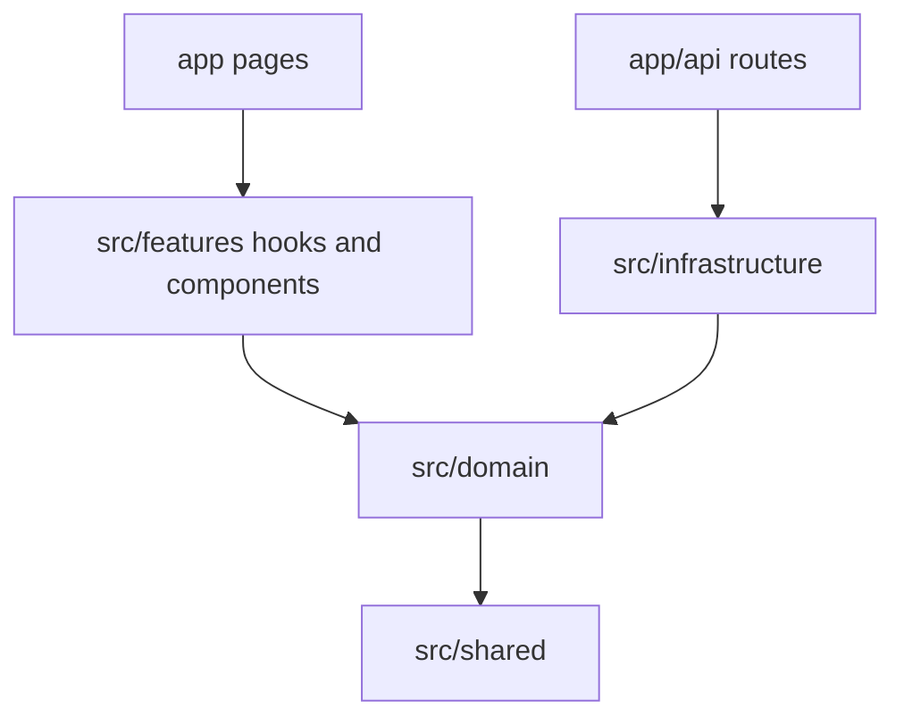

# Poseidon — API Documentation & OpenAPI Toolkit

Next.js application for managing OpenAPI specifications: endpoint documentation, interactive playground, validation suites, flow testing, version history with semantic diffing, and Excel export.

## Features

- **Spec management** — Upload, list, search, and delete OpenAPI specs with version history
- **Documentation** — Browse endpoints by controller, track working status and notes
- **Playground** — Try endpoints with auth, environments, and server-side proxy (SSRF-safe)
- **Validation** — Generate and run validation test suites per endpoint
- **Flows** — Multi-step API flow diagrams and execution
- **Diff** — Compare spec versions with severity classification (breaking / non-breaking / additive)
- **Export** — Download endpoint tables as styled Excel workbooks

## Architecture

Routes stay in root [`app/`](app/). Business logic lives under [`src/`](src/):

```text
app/                    Next.js App Router (pages + API routes)
src/
├── features/           UI feature modules (hooks, components)
├── domain/             Framework-independent business logic
├── infrastructure/     Postgres repositories, LLM, proxy handlers
└── shared/             Pure utilities, errors, shared UI primitives
lib/                    Compatibility re-exports + playground HTTP, security
```



See [AGENTS.md](AGENTS.md) for agent-oriented conventions and pitfalls.

## Prerequisites

- Node.js 20+ (Docker image uses Node 24)
- npm
- PostgreSQL 16+ (local install or Docker via `npm run docker:db`)

## Setup

```bash
npm install
cp .env.local.example .env
npm run docker:db    # optional: Postgres in Docker on port 15432
npm run db:migrate
npm run dev
```

Open [http://localhost:3000](http://localhost:3000).

## Development

| Command | Description |
|---------|-------------|
| `npm run dev` | Dev server (Turbopack) |
| `npm run build` | Production build |
| `npm run start` | Run production server |
| `npm run lint` | ESLint |
| `npm test` | Unit tests (`tsx --test`) |
| `npm run db:generate` | Generate Drizzle migrations |
| `npm run db:migrate` | Run Postgres migrations |
| `npm run docker:db` | Start Postgres container |
| `npm run docker:app` | Run app + Postgres in Docker |

Migrations also run automatically on server startup via `instrumentation.ts`.

## Database

- **Engine:** PostgreSQL only
- **Schema:** `src/infrastructure/database/pg-flow-schema.ts`
- **Migrations:** `drizzle/pg/`
- **Env:** `DATABASE_URL` (required)

## Docker

```bash
# Postgres only
npm run docker:db

# Full stack (set DATABASE_URL in .env for web-only compose, or use overlay)
docker compose -f docker-compose.db.yml -f docker-compose.postgres.yml up -d --build
```

See [DOCKER.md](DOCKER.md).

Published image: `seyha2023/list-endpoints-app:latest`

## Environment variables

| Variable | Purpose |
|----------|---------|
| `DATABASE_URL` | PostgreSQL connection string (required) |
| `INTERNAL_APP_URL` | Server-side self-fetch base URL |
| `OLLAMA_HOST` | LLM endpoint for test-case generation |
| `ENABLE_LLAMA_GENERATE` | Set `false` to disable `/api/llama-generate` |

## License

Private project (`package.json`).
